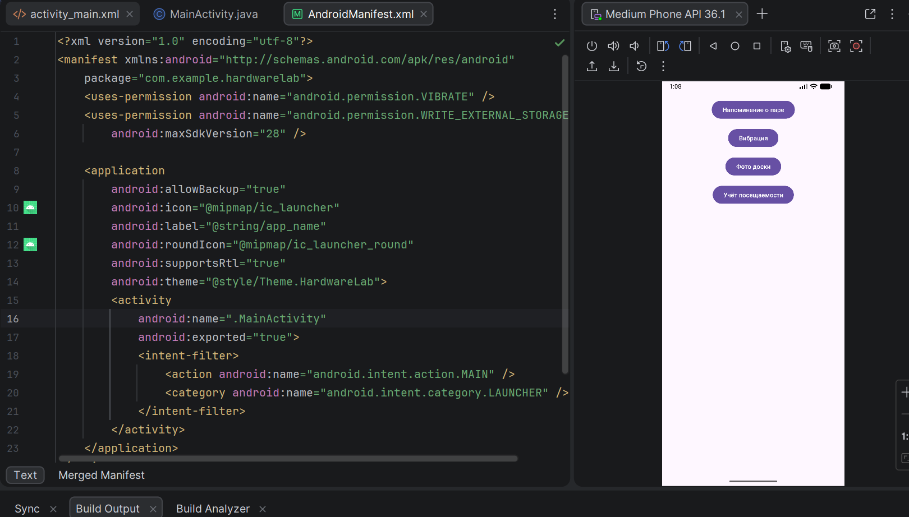
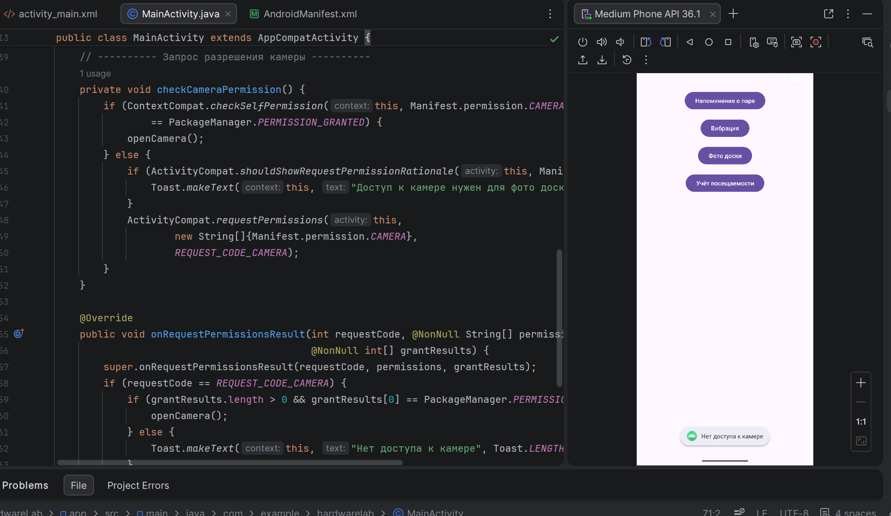
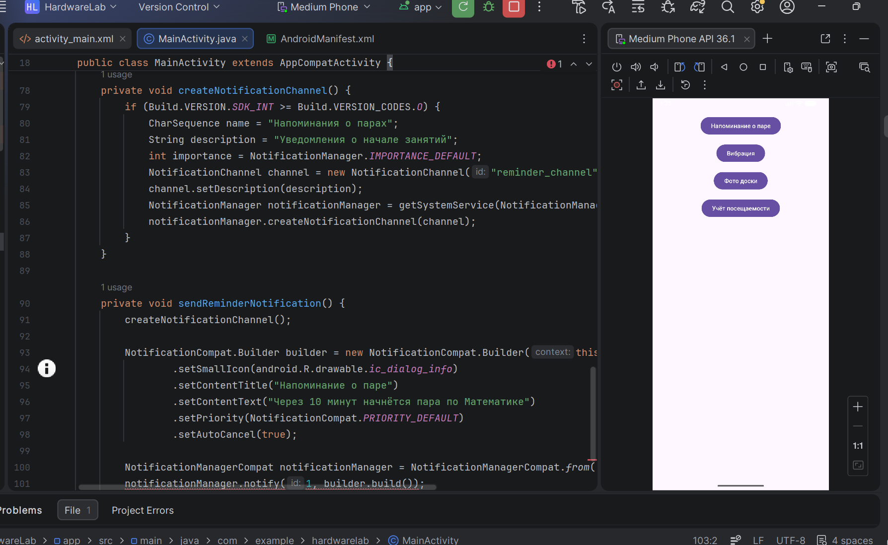
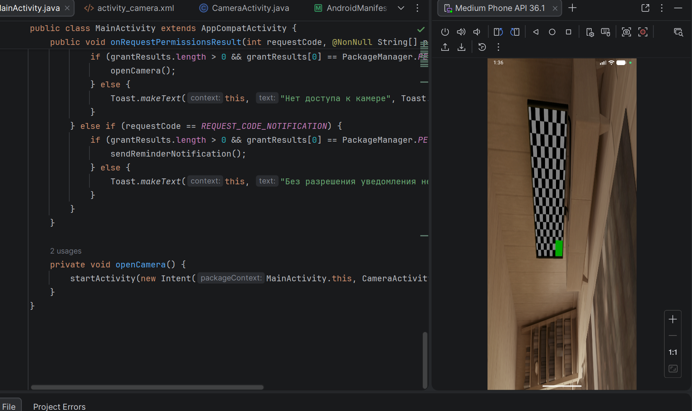

# Практическая работа №10: Использование аппаратных возможностей. Разрешения, уведомления, вибрация, камера

**Выполнил:**  
Саньков Андрей Александрович  
Группа: ИНС-б-о-24-1  
Направление: 09.03.02 «Информационные системы и технологии»

---

## Цель работы

Изучить механизм работы с разрешениями в Android, научиться создавать уведомления (Notification), управлять вибрацией устройства, а также получать доступ к камере для предварительного просмотра изображения.

---

## Ход работы

### Задание 1. Создание проекта и подготовка манифеста

Создан проект HardwareLab с шаблоном Empty Views Activity. В файл AndroidManifest.xml добавлены разрешения: CAMERA, VIBRATE и WRITE_EXTERNAL_STORAGE . Разработан интерфейс главного экрана (activity_main.xml), содержащий четыре кнопки: «Напоминание о паре», «Вибрация», «Фото доски», «Учёт посещаемости».



**Рисунок 1** — Добавление разрешений и подготовка интерфейса

### Задание 2. Запрос разрешений во время выполнения

Реализован запрос опасного разрешения CAMERA для доступа к камере. В методе checkCameraPermission() проверяется текущее состояние разрешения с помощью ContextCompat.checkSelfPermission(). Если разрешение не предоставлено, выводится пояснение через ActivityCompat.shouldShowRequestPermissionRationale() (опционально) и отправляется запрос через ActivityCompat.requestPermissions(). Результат обрабатывается в колбэке onRequestPermissionsResult(): при успехе вызывается метод openCamera(), при отказе пользователь информируется сообщением. Вызов проверки назначен на кнопку «Фото доски»



**Рисунок 2** — Запрос разрешения на камеру во время выполнения

### Задание 3: Создание уведомления
Реализована отправка уведомлений с напоминанием о предстоящей паре. Для Android 13 и выше добавлен запрос разрешения POST_NOTIFICATIONS — при первом нажатии кнопки «Напоминание о паре» пользователь подтверждает разрешение. Для Android 8+ создан канал «Напоминания о парах». Само уведомление содержит заголовок и текст, автоматически закрывается при нажатии. Функция проверена на эмуляторе — после предоставления разрешения уведомление появляется в шторке.
Код уведомлений из MainActivity.java:
```
// Константа для запроса разрешения уведомлений (Android 13+)
private static final int REQUEST_CODE_NOTIFICATION = 101;

// Проверка и запрос разрешения перед отправкой
private void checkAndSendNotification() {
    if (Build.VERSION.SDK_INT >= Build.VERSION_CODES.TIRAMISU) {
        if (ContextCompat.checkSelfPermission(this, Manifest.permission.POST_NOTIFICATIONS)
                == PackageManager.PERMISSION_GRANTED) {
            sendReminderNotification();
        } else {
            ActivityCompat.requestPermissions(this,
                    new String[]{Manifest.permission.POST_NOTIFICATIONS},
                    REQUEST_CODE_NOTIFICATION);
        }
    } else {
        sendReminderNotification();
    }
}

// Создание канала уведомлений 
private void createNotificationChannel() {
    if (Build.VERSION.SDK_INT >= Build.VERSION_CODES.O) {
        NotificationChannel channel = new NotificationChannel(
                "reminder_channel", "Напоминания о парах",
                NotificationManager.IMPORTANCE_DEFAULT);
        channel.setDescription("Уведомления о начале занятий");
        NotificationManager manager = getSystemService(NotificationManager.class);
        manager.createNotificationChannel(channel);
    }
}

// Отправка уведомления
@SuppressLint("MissingPermission")
private void sendReminderNotification() {
    createNotificationChannel();
    NotificationCompat.Builder builder = new NotificationCompat.Builder(this, "reminder_channel")
            .setSmallIcon(android.R.drawable.ic_dialog_info)
            .setContentTitle("Напоминание о паре")
            .setContentText("Через 10 минут начнётся пара по Математике")
            .setPriority(NotificationCompat.PRIORITY_DEFAULT)
            .setAutoCancel(true);
    NotificationManagerCompat.from(this).notify(1, builder.build());
}
```


**Рисунок 3** — Создание уведомления

### Задание 4. Управление вибрацией
Добавлена возможность вызова вибрации устройства. При нажатии кнопки «Вибрация» проверяется доступность вибромотора. Используется VibrationEffect.createWaveform() с паттерном [0, 500, 1000, 500] (вибрация 500 мс, пауза, снова вибрация). Разрешение VIBRATE предоставляется системой автоматически, запрос не требуется.
Основной блок кода:
```
private void vibrate() {
    Vibrator vibrator = (Vibrator) getSystemService(Context.VIBRATOR_SERVICE);
    if (vibrator != null && vibrator.hasVibrator()) {
        if (Build.VERSION.SDK_INT >= Build.VERSION_CODES.O) {
            vibrator.vibrate(VibrationEffect.createWaveform(
                    new long[]{0, 500, 1000, 500}, -1));
        } else {
            vibrator.vibrate(new long[]{0, 500, 1000, 500}, -1);
        }
    }
}

// Подключение кнопки
Button btnVibrate = findViewById(R.id.btnVibrate);
btnVibrate.setOnClickListener(v -> vibrate());
```

### Задание 5. Предварительный просмотр камеры
Создана активность CameraActivity с SurfaceView для отображения потока с камеры. Реализованы колбэки SurfaceHolder.Callback: при создании поверхности открывается задняя камера (Camera.open()), при изменении запускается startPreview(), при уничтожении поверхности камера освобождается. Разрешение CAMERA запрашивается во время выполнения перед запуском активности. Переход к камере выполняется по нажатию кнопки «Фото доски» из главного меню.



**Рисунок 4** — Предварительный просмотр камеры

## Контрольные вопросы
### 1. В чём разница между нормальными и опасными разрешениями? Приведите примеры.

Нормальные разрешения не затрагивают конфиденциальность пользователя, предоставляются автоматически при установке (например, INTERNET, VIBRATE).

Опасные разрешения дают доступ к личным данным или управлению устройства (камера, контакты, местоположение). Начиная с Android 6.0, их необходимо запрашивать во время выполнения, и пользователь может отказать. Примеры: CAMERA, ACCESS_FINE_LOCATION, READ_CONTACTS, POST_NOTIFICATIONS (Android 13+).

### 2. Как запросить опасное разрешение во время выполнения приложения? Опишите последовательность действий.

Проверить, есть ли уже разрешение: ContextCompat.checkSelfPermission(context, permission) == PERMISSION_GRANTED.

Если нет — при необходимости показать обоснование через ActivityCompat.shouldShowRequestPermissionRationale().

Запросить разрешение: ActivityCompat.requestPermissions(activity, new String[]{permission}, requestCode).

Обработать результат в колбэке onRequestPermissionsResult(int requestCode, String[] permissions, int[] grantResults) — проверить grantResults[0] == PERMISSION_GRANTED.

### 3. Для чего нужен NotificationChannel в Android 8.0 и выше?

NotificationChannel позволяет группировать уведомления по категориям и даёт пользователю возможность настраивать поведение каждой категории (звук, вибрация, важность, показ на экране блокировки). Приложение обязано создать хотя бы один канал, иначе уведомление не отобразится на API 26+.

### 4. Как создать простое уведомление и отобразить его?

Создать канал (для API 26+): NotificationChannel channel = new NotificationChannel(id, name, importance); manager.createNotificationChannel(channel);

Построить уведомление через NotificationCompat.Builder(context, channelId):

Установить иконку setSmallIcon(), заголовок setContentTitle(), текст setContentText(), приоритет, авто‑закрытие.

Отправить: NotificationManagerCompat.from(context).notify(id, builder.build());.

### 5. Какие методы класса Vibrator используются для создания вибрации? Как создать вибрацию с заданным паттерном?

Простая вибрация заданной длительности: vibrator.vibrate(milliseconds).

Вибрация по паттерну (устаревший способ): vibrator.vibrate(long[] pattern, int repeat).

На API 26+ рекомендуется VibrationEffect.createWaveform(long[] timings, int repeat) и вызов vibrator.vibrate(vibrationEffect).
Пример паттерна: new long[]{0, 500, 1000, 500} — без задержки, вибрация 500 мс, пауза 1 с, снова вибрация 500 мс. Параметр -1 означает без повторов.

### 6. Как получить доступ к камере для предварительного просмотра? Какие классы для этого используются?

Используются классы Camera (устаревший) или Camera2. В работе применялся Camera.

Порядок: создать SurfaceView, получить SurfaceHolder и добавить колбэк SurfaceHolder.Callback.

В surfaceCreated() открыть камеру Camera.open(), установить setPreviewDisplay(holder).

В surfaceChanged() запустить startPreview().

В surfaceDestroyed() остановить превью и освободить камеру release(). Обязательно объявить разрешение CAMERA и запросить его во время выполнения.

### 7. Что произойдёт, если попытаться использовать опасное разрешение без его запроса во время выполнения на Android 6.0+?

Будет выброшено исключение SecurityException, и приложение аварийно завершится (краш). Поэтому перед выполнением операции, требующей опасного разрешения, нужно обязательно проверить и при необходимости запросить его.

### 8. Как проверить, есть ли у приложения определённое разрешение в данный момент?

Вызвать ContextCompat.checkSelfPermission(context, Manifest.permission.ИМЯ_РАЗРЕШЕНИЯ) и сравнить результат с PackageManager.PERMISSION_GRANTED. Например:
```
if (ContextCompat.checkSelfPermission(this, Manifest.permission.CAMERA)
        == PackageManager.PERMISSION_GRANTED) {
    // разрешение есть
} else {
    // нужно запросить
}
```

